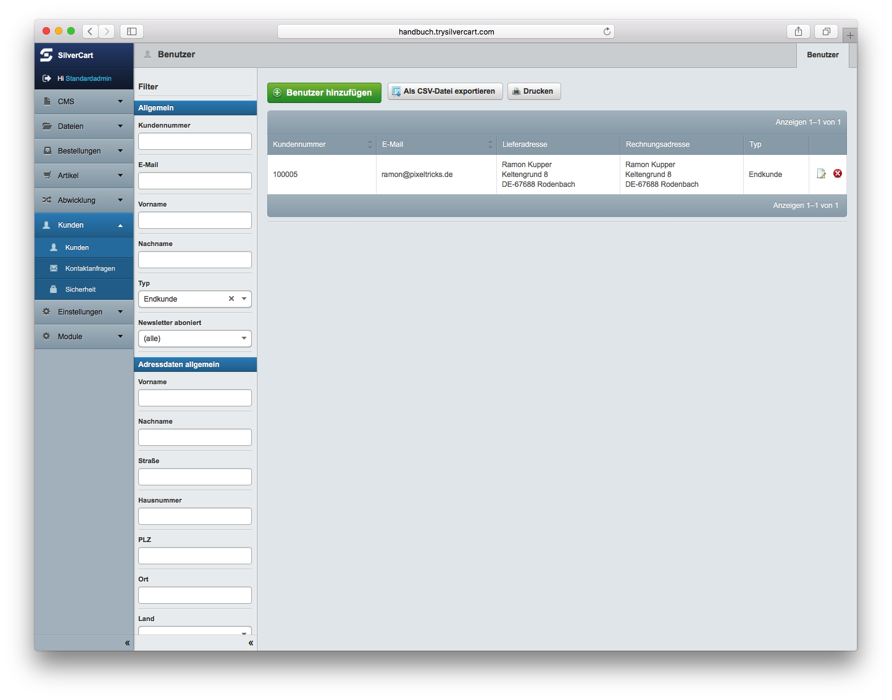

# Tab Kunden

## Kunden

Im Auslieferungszustand gibt es in SilverCart vier verschiedene Kundenklassen: 

* Endkunden
* anonyme Kunden
* Geschäftskunden
* Administratoren

Für jede Kundenklasse kann festgelegt werden, ob die Produktpreise brutto (inklusive Mehrwertsteuer) oder netto (exklusive Mehrwertsteuer) angezeigt werden. Öffnen Sie dazu das Konfigurationsobjekt (siehe Allgemeine Konfiguration): 

Im Reiter "Preise" können Sie unter "Preistypen" die entsprechenden Einstellungen vornehmen.
Außerdem können Bezahl- und Versandarten auf Kundenklassen beschränkt werden.

** Endkunde **

Ein Kunde, der sich über das Registrierungsformular von SilverCart anmeldet, ist ein Endkunde. 

** Anonyme Kunden **

Anonyme Kunden sind alle Kunden, die einen Warenkorb befüllen/anlegen. Durch diesen Mechanismus ist es möglich den Bestellprozess ohne anlegen eines Kundenkontos abzuschließen. Besitzt ein anonymer Kunde einen Warenkorb und registriert sich während des Bestellprozesses wird der Warenkorb auf den neu angelegten Kunden übernommen und der Prozess kann somit ohne weitere Verzögerung abgeschlossen werden.

** Geschäftskunden **

Um zu einem Geschäftskunden zu werden, muss ein registrierter Kunde von einem Administrator in dem Bereich "Sicherheit" in eine Geschäftskundengruppe verschoben werden. SilverCart übernimmt den Rest für Sie und stellt, je nach Konfiguration, alle Preise auf Nettopreise um. Außerdem wird nun ausdrücklich der Hinweis `exkl. MwSt.` an allen Artikelpreisen angezeigt.

### Kunden suchen

Zur Verwaltung der Kunden in Ihrem SilverCart-Webshop stehen Ihnen umfangreiche Filter zur Verfügung.
Allgemeine Daten

* Kundennummer
* E-Mail
* Vorname
* Nachname
* Typ
* Newsletter abonniert

Adressdaten allgemein
* Vorname
* Nachname
* Straße
* Hausnummer
* PLZ
* Ort
* Land

Rechnungsadresse
* Vorname
* Nachname
* Straße
* Hausnummer
* PLZ
* Ort
* Land

Lieferadresse
* Vorname
* Nachname
* Straße
* Hausnummer
* PLZ
* Ort
* Land

### Kunden-Detailansicht

Sie gelangen zur Kunden-Detailansicht indem Sie einen Kundeneintrag aus der Übersicht auswählen (anklicken).

In der Detailansicht finden Sie alle bekannten Informationen über den Kunden sowie alle verknüpften Bestellungen und Adressen.

## Kontaktanfragen

SilverCart verfügt über eine Kontaktformularseite, die in einer Standardinstallation automatisch angelegt wird. Über das Kontaktformular kann jeder Besucher der Seite eine Nachricht an den Shopbetreiber schicken. Dabei hinterlässt er eine E-Mail-Adresse, Vor- und Nachnamen und eine Nachricht. Der Shopbetreiber bekommt zum einen eine Kontakt-E-Mail an die Adresse, die er in der Konfiguration hinterlegt hat. Zum anderen wird jede Kontaktanfrage noch einmal im System gespeichert. 

Die Übersicht zeigt das Datum und die Uhrzeit, den Namen und die E-Mail-Adresse der Anfrage.

## Sicherheit

Hinter dem Menüpunkt "Sicherheit" steckt die Benutzerverwaltung von SilverCart. Hier werden alle registrierten Benutzer nach Benutzergruppen sortiert angezeigt. 

In der Baumstruktur auf der linken Seite werden die Benutzergruppen angezeigt. Wenn Sie die Wurzel "Sicherheitsgruppen" anwählen, werden alle registrierten/angelegten Benutzer angezeigt. Wenn Sie hier einen Benutzer löschen, dann wird er vollständig aus dem System gelöscht. Befinden Sie sich hingegen in einer Gruppe beim Löschen eines Nutzers, so wird er nur aus der Gruppe entfernt.

Mitglieder in der Gruppe "Administratoren" haben vollen Zugriff auf das Back-End. "Inhaltsautoren" können die Bereiche "Sicherheit" "Silvercart Administration" und "Silvercart Konfiguration" nicht betreten.

Sollte ein Besucher ohne Anmeldung etwas in den Warenkorb legen, so wird ein "Anonymer Kunde" erzeugt und automatisch eingeloggt. Der Warenkorb des anonymen Kunden bleibt dann einige Tage bestehen, sollte er sich nicht zu Checkout begeben. Registriert sich ein Nutzer während des Bestellprozesses, dann wird ein Endkunde erzeugt und der Warenkorb auf diesen Endkunden übertragen. Das gleiche passiert mit einem Kunden, der etwas in den Warenkorb legt und sich dann erst einloggt.

----