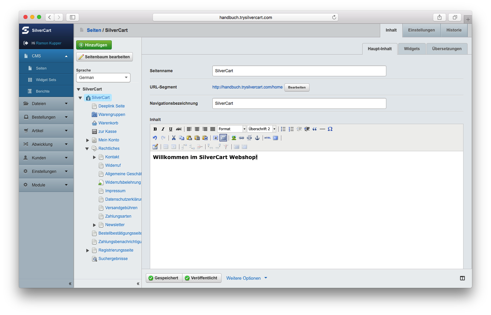
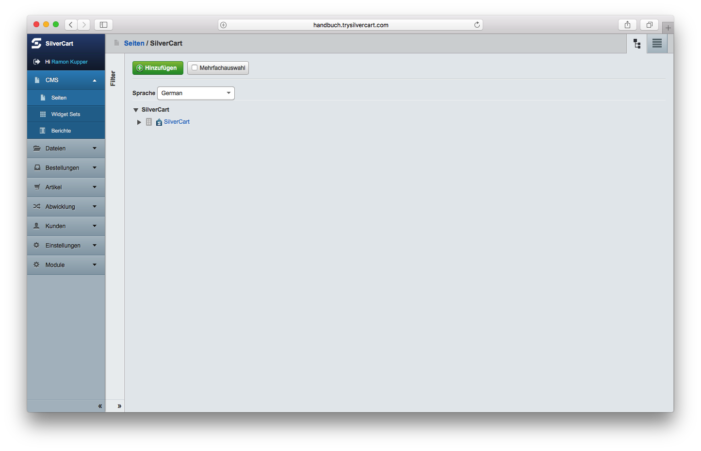
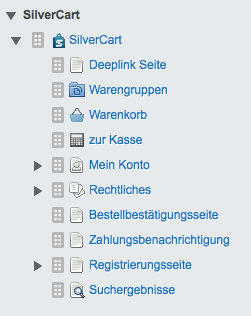
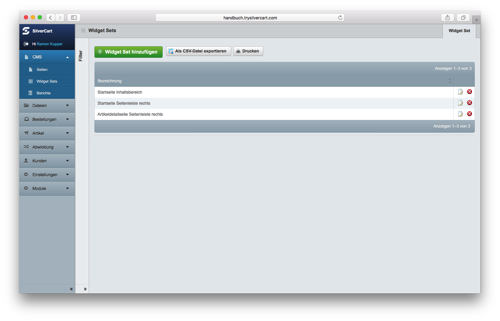
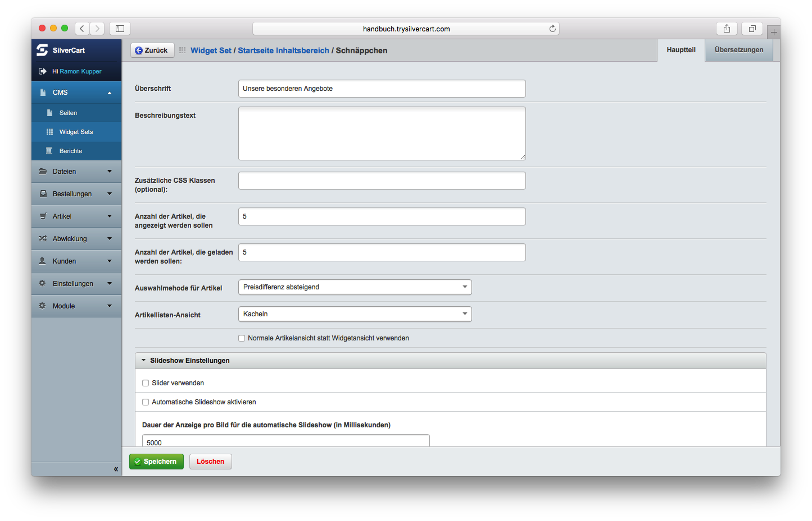
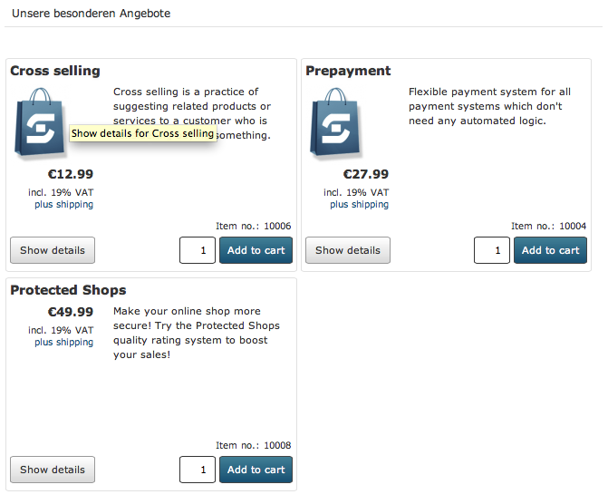
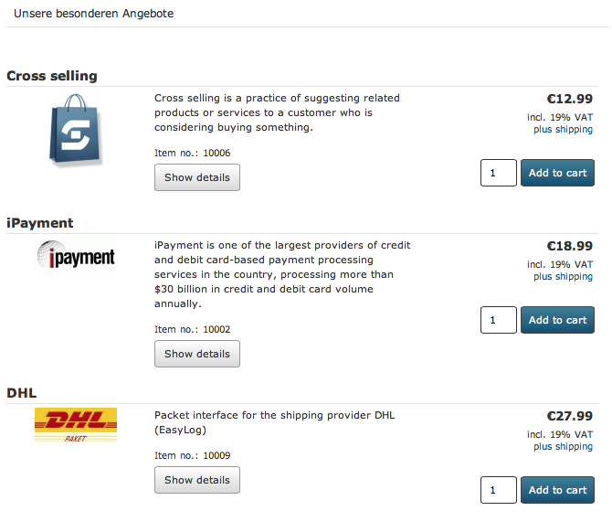
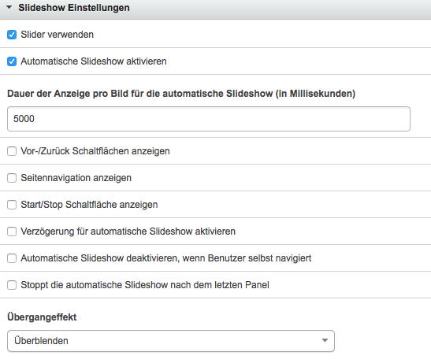

# Tab CMS

Mit SilverCart haben Sie nicht nur einen Online-Shop, sondern auch ein vollwertiges CMS mit umfangreichen Funktionen, das mit weiteren Modulen erweitert und sogar als Forum genutzt werden kann.

Im folgenden Kapitel erlernen Sie die Grundlagen im Umgang mit dem CMS und erfahren, wie Sie neue Seiten anlegen und bestehende Seiten verändern können.

## Seitentypen

Seitentypen bilden das Rückgrat des CMS und der SilverCart-Shopsoftware. Sie sind in integraler Bestandteil der Philosophie des Systems. Bei der täglichen Arbeit mit dem CMS und der Shopsoftware ist es deshalb hilfreich, das Konzept der Seitentypen zu kennen.

Eine moderne Website (ein Online-Shop ist eine spezielle Website) besteht aus vielen einzelnen Seiten. Dabei müssen diese Seiten unterschiedliche Aufgaben erfüllen: es gibt Kontaktformulare, Übersichtsseiten, Artikeldetailseiten, Warenkorbseiten und beispielsweise die verschiedenen Funktionen im Kundenkonto.
Diese besonderen Seiten werden in SilverCart durch Seitentypen abgebildet. 

Ein Seitentyp ist sozusagen ein eigens entwickelter Container, der sich aus Inhalt, Gestaltung und Verhalten definiert. 

Dabei lassen sich alle Seitentypen von einer Grundform ableiten. Das bedeutet, das alle Seitentypen die Basiseigenschaften einer einfachen CMS-Seite erben.

Im Backend können Sie bestehende Seitentypen verwenden und darauf basierende Seiten mit den möglichen Inhalten pflegen. Oftmals haben Seitentypen eigene Pictogramme, die einen Hinweis auf die Verwendungsart geben.

Die Anpassung bestehender Seitentypen und die Entwicklung neuer Seitentypen kann nicht im Backend erfolgen. Hierfür muss ein Entwickler auf Quelltextebene in die Programmierung eines bestehenden Seitentyps eingreifen oder einen neuen Seitentyp entwickeln. 

Für die Anpassung und die Entwicklung von Seitentypen sind Erfahrungen mit der Programmiersprache PHP und dem PHP-Framework SilverStripe bzw. Kenntnisse in HTML und CSS notwendig. Ein empfehlenswerter Einstiegspunkt für die Entwicklung ist die Startseite der SilverStripe Dokumentation http://docs.silverstripe.org/en/3.1/

| Seitentyp        | Zweck           |
| ------------- |-------------|
| Accountübersicht |       |
| Adressseite | Zeigt eine einzelne Adresse eines Kunden im Detail an. |
| Adressübersichtseite | Zeigt alle Adressen des Kunden in einer Übersicht an. |
| Artikelgruppenübersicht | Zeigt alle Artikelgruppen an, die sich unterhalb der aktuellen Ebene befinden. |
| Bestellbestätigungsseite | Diese Seite wird angezeigt, nachdem der Kunde eine Bestellung erfolgreich abgeschlossen hat. |
| Bestelldetailsseite | Zeigt die Details einer einzelnen Bestellung an. |
| Bestellübersicht | Zeigt eine Übersicht aller Bestellungen an. |
| Checkout Schritt | Der Checkout-Prozess erstreckt sich über mehrere Schritte. Dieser Seitentyp wird dabei verwendet. |
| Custom Html Form Step Page |  Spezielle Seite für mehrschrittige Formulare. |
| Datenseite |      |
| Downloadseite |      |
| Downloadseitenübersicht |      |
| Fehlerseite | Spezieller Inhalt für andere Fehlerfälle (z.B. "Seite nicht gefunden")      |
| Frontseite | Frontpage (Startseite) des Webshops |
| Kontaktformularantwortseite | Diese Seite wird angezeigt, nachdem das Kontaktformular abgesendet wurde. |
| Kontaktformularseite | Seite mit Kontaktformular |
| Meta-Informations-Seite |      |
| Metanavigationsübersicht |      |
| Newsletter Opt-In Seiten |      |
| Newsletter-Antwort-Seite |      |
| Newsletter-Seite |      |
| Registrierungs-Willkommens-Seite |      |
| Registrierungsbestätigungsseite | Wird angezeigt, nachdem der Kunde die Registrierung erfolgreich abgeschlossen hat. |
| Registrierungsseite | Diese Seite zeigt das Registrierungsformular an. |
| Seite | Einfache Basis-Seite mit einem HTML-Inhaltsfeld und Meta-Informationen. Alle andere Seitentypen werden von hiervon abgeleitet und erweitert. |
| SiteMap | Erzeugt eine Sitemap |
| Suchergebnisseite | Zeigt alle Ergebnisse an, die über die Suchfunktion gefunden wurden. |
| Versandgebührenseite | Ermittelt alle Versandgebühren und zeigt diese an |
| Virtuelle Seite | Zeigt den Inhalt einer anderen Seite |
| Warengruppe |      |
| Warenkorbseiten |      |
| Weiterleitungsseite |  Leitet zu einer anderen internen Seite weiter    |
| Widerruf-Seite |      |
| Zahlungsartseite |      |
| Zahlungsbenachrichtigung |      |

## Anatomie einer Seite

Der ursprünglichste Seitentyp ist die „Page“. Eine Page enthält keine besondere Funktionalität und ist ein einfacher Container für einige Grundfelder.
Diese Felder können verschiedene Arten von Informationen speichern. So kann ein Textfeld beispielsweise nur unformatierten Text speichern, während ein HTML-Feld umfangreich formatierten Text, Hyperlinks zu anderen Seiten und sogar Bilder speichern kann.

Aus technischer Sicht sind alle anderen Seitentypen sozusagen Nachfahren des Seitentyps Page und teilen sich bestimmte Eigenschaften, wie z.B. die Einbindung in den Seitenbaum und damit die Möglichkeit eine Hierarchie erstellen zu können.

### Seitenname (Textfeld)
In diesem Feld können Sie den Namen der Seite pflegen. Der Name der Seite wird im Browser in der Titelleiste angezeigt. Finden Sie einen aussagekräftigen Namen, der hilfreich für Besucher und Suchmaschinen ist. Da es sich um ein Textfeld hab

### URL-Segment (Textfeld)
Das URL-Segment ist ein Teil der Adresse, unter der diese Seite erreichbar ist. Achten Sie hier auf Aspekte der Suchmaschinenoptimierung, denn die URL und darin enthaltene Keywords werden von Suchmaschinen ausgewertet.
 
Das URL-Segment ist hierarchisch aufgebaut, deshalb sind der Seitenadresse die URL-Segmente der übergeordneten Seiten vorangestellt. Ändert sich das URL-Segment einer Seite, dann ändert sich auch der Pfad zu untergeordneten Seiten.

### Navigationsbezeichnung (Textfeld)
Die Navigationsbezeichnung wird in Menüs im Front-End und auch im Seitenbaum des Back-Ends angezeigt. In der Regel werden Sie hier den Seitennamen verwenden. Passen Sie die Navigationsbezeichnung an, wenn der Seitenname zu lang oder als Menüeintrag ungeeignet ist.

### Inhalt (HTML-Feld)
Das Inhaltsfeld - oft auch Content genannt - ist der eigentliche Inhalt der Seite. Deshalb stellt Ihnen das CMS hier einen mächtigen WYSIWYG-Editor (What You See Is What You Get) zur Verfügung, mit dem Sie Ihren Text umfangreich formatieren können und sogar Grafiken, Tabellen, Videos einbinden können.

### Meta-Daten
Die Meta Beschreibung und die Benutzerdefinierten Meta-Tags sind hilfreich für eine gute Platzierung in den Suchmaschinenergebnissen. Es lohnt sich, die Meta-Description mit sinnvollen Inhalten zu füllen.

### IdentifierCode
Manchmal ist es für das Shopsystem wichtig, eine bestimmte Seite eindeutig bestimmen zu können, selbst wenn diese von Ihnen verändert wurde. 

Ein Beispiel hierfür ist die Bestellbestätigungsseite, die angezeigt wird, wenn ein Kunde seine Bestellung erfolgreich abgeschlossen hat. Diese Seite können Sie frei° mit Inhalten füllen. Da Sie dabei auch den Seitennamen und die Navigationsbezeichnung ändern können, sind diese nicht eindeutig. Deshalb gibt es mit dem IdentifierCode die Möglichkeit, einer Seite eindeutig zu referenzieren. 

In den meisten Fällen kann dieses Feld leer bleiben, wenn weder der Shop noch einzelne Module gezielt auf eine Seite zugreifen müssen. Es ist wichtig, dass Sie keine Änderungen an bestehenden Einträgen vornehmen, denn dadurch können bestimmte Funktionen ausgehebelt werden.

### Unterseiten dieser Seite bilden Haupt-Navigation
Die Haupt-Navigation, welche bei Grund-Installation die Warengruppen beinhaltet, wird aus den Unterseiten dieser Seite gebildet. Es darf in jeder Sprache nur eine Seite geben, die diese Einstellung aktiv hat. 
Hinweis: Bei einer neu erstellten Überetzung ist diese Option nicht gesetzt.

>Hintergrund: Wenn Sie SilverCart nachträglich als Modul in Ihre SilverStripe-Website installieren, dann wird das zu einen Konflikt zwischen der SilverCart-Navigation und der bereits existierenden Navigation führen.
Diesen Konflikt können Sie durch die Aktivierung dieser Option vermeiden. In diesem Fall wird die bereits bestehende Haupt-Navigation beibehalten und die SilverCart-Navigation nicht aktiviert. Statt der Hauptnavigation können Sie z.B. das Navigations-Widget verwenden.

Diese Einstellung können Sie auch verwenden, wenn Sie Ihre Warengruppen-Hierarchie überarbeiten und die Hauptnavigation ohne Zeitverlust auf parallel erstellte Hierarchie umstellen möchten.

## Der Editor TinyMCE

Der im CMS integrierte Editor TinyMCE (Tiny Moxiecode Content Editor) ist ein auf JavaScript basierter WYSIWYG-Editor. TinyMCE wurde erstmals 2004 veröffentlicht und seit dem stetig weiter entwickelt und verbessert. 

Mit Hilfe von TinyMCE können Sie ohne HTML-Kenntnisse Seiten und Beiträge im CMS verfassen. Hierbei wird Ihre Eingabe in der Textbox von JavaScript in Echtzeit in HTML-Code umgesetzt und als Vorschau ausgegeben. Die Bedienung ist einfach und orientiert sich stark an Microsoft Word.

## Seiten

Unter dem Menüpunkt Seiten verwalten Sie den Seitenbaum Ihres Webshops. Die Darstellung der Elemente im Back-End ist hierarchisch. Die Reihenfolge im Back-End ist jedoch nicht zwingend identisch mit der Anzeige im Frontend. Je nach Layout und Design des Ihres Webshops kann die Reihenfolge im Frontend und im Back-End unterschiedlich sein. 

Sie können einen Knoten mit einem Klick auf das Dreieck links neben dem Knoten öffnen oder schliessen:

Mit der Schaltfläche „Hinzufügen“ können Sie eine neue Seite anlegen. Es gibt je nach installierten Modulen ganz unterschiedliche Seitentypen. In SilverCart werden z.B. die Warengruppen über Seitentypen abgebildet.

Seitentypen sind ein grundlegendes Konzept und einer der Vorteile des CMS SilverStripe.

Mit einem Klick auf das +-Zeichen des Knotens machen Sie Unterseiten im Seitenbaum sichtbar. Durch einen Klick auf die Überschrift der gewünschten Seite könne Sie diese bearbeiten.

Warengruppen können Sie in beliebiger Tiefe verschachteln. SilverCart erstellt die Navigation und Übersicht der Warengruppen vollautomatisch.

Achtung: Warengruppen, denen keine Produkte zugeordnet sind und die auch keine weiteren Warengruppen erhalten, werden im Front-End nicht angezeigt.

An dieser Stelle können Sie keine Produkte pflegen. Die Pflegemaske für Produkte finden Sie unter SilverCart Administration -> Artikel

### Warenkorb / zur Kasse

Über diesen Menüpunkt können Sie die Metadaten (Meta-Title, Meta-Description und Meta-Keywords) der Warenkorbseite und der Checkoutseite pflegen. Ausserdem kann das URL-Segment der Seiten gepflegt werden.

### Mein Konto

Dies ist der persönliche Bereich Ihrer Shopkunden. Hier kann der Shopkunde seine persönlichen Daten, seine bisherigen Bestellungen und seine Liefer- und Rechnungsadressen zu verwalten.

Auch hier können Sie die Metadaten und die URL-Segmente pflegen.

Grundsätzlich besteht die Möglichkeit, hier auch Inhalte zu pflegen, die im Frontend angezeigt werden können. Da dies wegen der dynamischen Erzeugung jedoch fortgeschrittene Kenntnisse erfordert, nutzen wir diese Möglichkeit nur in Einzelprojekten.

### Metanavigationsübersicht

In der Metanavigationsübersicht können Sie die Hilfsseiten pflegen. Hilfsseiten sind Seiten mit Inhalt, die zwar für den (rechtssicheren) Betrieb des Webshops unerlässlich sind, aber nicht in einer klassischen Navigationsstruktur dargestellt werden sollen. Die Inhalte dieser Seiten können Sie mit Ausnahme von Kontakt und Versandgebühren selbst pflegen. Auch die Metadaten und die URL-Segmente können Sie bei diesen Seiten verändern.

In einer SilverStripe-Grundinstallation wird jede Seite über das URL-Segment eindeutig identifiziert. Da viele Seiten intern miteinander verlinkt sind, würde eine Veränderung des URL-Segments zu Fehlern führen. Deshalb sind die Seiten intern über das Feld IdentifierCode verbunden, unabhängig vom URL-Segment. Ändern Sie den Wert für den IdentifierCode nicht!

### Footernavigationsübersicht

Die Footernavigationsübersicht gruppiert die Seiten, die im Footer verlinkt werden sollen. Es gibt zwar die Möglichkeit, diese hartkodiert im Template zu verlinken, doch würden Sie sich damit einiger Flexibilität berauben. Denn Änderungen in der Reihenfolge oder der Linktexte sind damit nicht mehr bequem möglich.

Hartkodiert bedeutet, dass die Links direkt als HTML in der Template-Datei stehen. Mit Template-Dateien können Entwickler und auch viele Designer besser und vor allem effizienter umgehen. Der technisch weniger versierte Redakteur wird diese Möglichkeit in der Regel nicht nutzen können. Unsachgemäße Änderungen im Template können den ganzen Shop lahmlegen.
Hier gibt es keine goldene Regel. Je nach Projekt, Anforderungen und Fertigkeit kann hier ganz individuell vorgegangen werden.

### Registrierungsseite

Über diesen Menüpunkt können Sie die den Content, Metadaten (Meta-Title, Meta-Description und Meta-Keywords) der Willkommen-Seite und die Registrierungsbestätigungsseite pflegen. Ausserdem kann das URL-Segment der Seiten gepflegt werden. Die darunter liegende Willkommen-Seite wird angezeigt nachdem sich ein Besucher erfolgreich im Shop registriert hat.

### Newsletter Status / Newsletteranmeldung abschließen

Diese Seiten sind Bestandteil der SilverStripe Grundinstallation. Sie können Inhalt, Metadaten und URL-Segment verändern.

Die "Newsletter Status" Seite lässt den Kunden wissen, ob er für den Newsletter registriert ist oder ob eine Registrierung noch aussteht.

Über die "Newsletteranmeldung abschließen" Seite lassen sich folgende Texte bezüglich des Newsletters pflegen:

* Standard Text
* Fehlermeldung
* Erfolgsmeldung
* Meldung, dass der Nutzer schon für den Newsletter registriert ist

### Seite nicht gefunden / Server error

Sollte eine Seite nicht gefunden werden, weil sich beispielsweise das URL-Segment geändert hat oder die Seite nicht mehr existiert, dann erzeugt SilverStripe den Fehlercode 404 und zeigt den Inhalt an, den Sie unter Seite nicht gefunden selbst pflegen können. Im Falle eines Serverfehlers wird der Fehlercode 500 zurückgeliefert. Auch hier können Sie den Inhalt selbst gestalten.

Nutzen Sie die Möglichkeit, Ihren Kunden im Fehlerfall alternative Links anzubieten oder zumindest eine aussagekräftige Fehlermeldung zu präsentieren.

## Widget Sets

Ein Widget ist ein kleines Programm zur Anzeige von Informationen, z.b. einem bestimmten Artikel aus dem Sortiment oder der Öffnungszeiten. Dabei kann ein Widget auch Informationen annehmen und verarbeiten, z.B. eine Login-Formulart oder ein Formular für eine Newsletter-Anmeldung.

Das Silbenkurzwort Widget ist zusammengesetzt aus Wi(ndow) und (Ga)dget. 

Die Stärke von Widgets liegt in der Wiederverwendbarkeit. Sie können beliebige Zusammenstellungen von SilverCart-Widgets als Widget-Sets abspeichern und auf bestimmten Seiten Ihres Webshops anzeigen. Dadurch haben Sie eine einfache, aber mächtige Möglichkeit um Ihren SilverCart Webshop optisch anzupassen.

### Widgets

Mit den folgenden Widgets können Sie Ihren Webshop individualisieren:

* Artikelmerkmal-Filter (nur mit Modul)
* Preis-Filter
* Schnäppchen
* Bilder
* Neueste Blogeinträge anzeigen
* Anmeldung
* Seitenliste
* Artikel aus Unterwarengruppen
* Artikel
* Herstellerliste
* Warengruppennavigation
* Suchformular
* Die häufigsten Suchbegriffe
* Warenkorb
* Slidorion Akkordeon
* Subnavigation
* Freitext
* Freitext mit Link
* Topseller

Die Widgets können Sie beliebig kombinieren. Manche Widgets können Sie auch mehrfach verwenden 
und mit unterschiedlichen Daten befüllen.

#### Schnäppchen

Mit dem Schnäppchen-Widget können Sie automatisiert die Produkte bewerben, die im Vergleich zur UVP (UnVerbindliche Preisempfehlung des Herstellers) die größte Preisdifferenz haben.

Das Widget errechnet dabei selbständig die Differenz zwischen dem (kundengruppenabhängigen) Verkaufspreis und der UVP jedes einzelnen Artikels im Webshop. Über das Dropdown-Feld Auswahlmethode für Produkte können Sie definieren, ob die Sortierung nach Preisdifferenz aufsteigend oder Preisdifferenz absteigend erfolgen soll.

In das Textfeld Überschrift können Sie eine passende Überschrift für Ihre Angebote eintragen.

Normale Artikelansicht statt Widgetansicht verwenden
Wenn Sie diese Option wählen, dann werden die Produktlisten im Slider genau so dargestellt, wie die Produktlisten in den Warengruppen.

SilverCart ermöglicht es Ihnen, hier ein anderes Design zu verwenden um die Schnäppchen hervorzuheben. Das Template für diese neue Design  gehört nicht zum Lieferumfang

Die Darstellung der Artikel kann als Kacheln oder als Liste erfolgen. Die beiden folgenden Abbildungen zeigen wie die Artikel im Front-End als Kacheln und als Liste dargestellt werden. 

Achten Sie bei der gekachelten Darstellung auf eine gerade Anzahl von Artikeln, da es ansonsten zu einer Lücke kommt. In diesem Beispiel habe ich deshalb absichtlich nur 3 Produkte ausgewählt.

Bei der Listendarstellung spielt es hingegen keine Rolle, wie viele Produkte Sie ausgewählt haben.

Anzahl der Artikel, die angezeigt werden sollen und Anzahl der Artikel, die geladen werden sollen
Wenn Sie keinen Slider verwenden, können Sie das Feld Anzahl der Artikel, die angezeigt werden sollen frei lassen. Es werden alle Artikel angezeigt, die auch geladen werden.

Für den Fall, dass Sie einen Slider einsetzen wollen, müssen Sie beide Felder pflegen. Die Anzahl der Artikel, die geladen werden sollen, muss dabei größer sein, als die Anzahl der angezeigten Artikel: es ist ja der Sinn des Sliders, durch eine Menge von Produkten blättern zu können.

#### Slideshow Einstellungen

##### Slider verwenden
Aktivieren Sie den Slider über die Checkbox Slider verwenden. 

##### Automatische Slideshow aktivieren
Wenn Sie Automatische Slideshow aktivieren auswählen, dann beginnt der Slider automatisch durch die Einträge zu blättern. Die Dauer der Anzeige pro Bild für die automatische Slideshow gibt dabei an, wie lange die Artikel dargestellt werden bis weiter geblättert wird. Die Dauer wird in Millisekunden angegeben (1 Sekunde entspricht 1000 Millisekunden). 
Experimentieren Sie mit der Anzeigedauer. Der Slider sollte dem Besucher genügend Zeit lassen um die dargestellten Einträge zu erkennen. Auf der anderen Seite soll die Pause nicht zu lange sein, damit die automatische Slideshow auch die gewünschte Aufmerksamkeitswirkung erzeugen kann.

##### Dauer der Anzeige pro Bild für die automatische Slideshow (in Millisekunden)

##### Vor-/Zurück Schaltflächen anzeigen

##### Seitennavigation anzeigen

##### Start/Stop Schaltfläche anzeigen

##### Verzögerung für automatische Slideshow aktivieren

##### Automatische Slideshow deaktivieren, wenn Benutzer selbst navigiert

##### Stoppt die automatische Slideshow nach dem letzten Panel

##### Übergangseffekt
* Überblenden 
* horizonzal schieben
* vertikal schieben

#### Übersetzungen
Rechts oben am Seitenrand haben Sie vielleicht schon den Tab Übersetzungen entdeckt. Von Übersetzungen in SilverCart haben Sie mittlerweile schon mehrmals gelesen, deshalb will ich an dieser Stelle nicht schon wieder damit anfangen - die Mehrsprachigkeit können Sie in den unterschiedlichen Bereichen immer nach diesem Schema pflegen.

### Widget Set erstellen

Erstellen Sie ein Widget Set über die Schaltfläche `Erstelle Widget Set` und geben Sie diesem einen Namen. (Zum Beispiel "Startseite"). Drücken Sie anschließend auf die Schaltfläche "Hinzufügen" um das neue Widget Set zu erstellen. Im Folgenden erscheinen zwei Boxen, worüber Sie die Widgets zuordnen und bearbeiten können.

Im Feld "Bezeichnung" können Sie dem Set einen Namen geben. Dieser erleichtert es Ihnen, das Set wieder zu finden, wenn sehr viele Widget Sets angelegt sind. Durch Klick auf den Pfeil wird das entsprechende Widget dem Set hinzugefügt und erscheint auf der rechten Seite. Beispielhaft wurde das schon für das Widget "Anmeldung" und "Warengruppen"" gemacht.

Jedes Widget hat kann über den Button "Bearbeiten" individuell eingestellt werden. Die Reihenfolge der Widgets kann über die Buttons "Nach oben schieben" oder "Nach unten schieben" verändert werden.

Wenn Sie Ihr Widget Set fertig konfiguriert haben, dann speichern Sie es mit dem "Hinzufügen" Knopf.

Wenn Sie auf eine Seite im Seitenbaum navigieren, können Sie unter Widgets die erstellten Sets sehen. Widget Sets können dem Inhaltsbereich (linke Spalte des Layout) oder der Seitenleiste (rechte Spalte des Layout) zugeordnet werden.

## Berichte

Über den Menüpunkt "Berichte" könne Sie Ihre Website nach falschen, fehlenden oder defekten Links zu durchsuchen. 

Sie können im Hauptbereich verschiedene Filter setzen um automatisiert nach fehlenden Dateien oder falsch verlinkten Seiten zu suchen. Das System listet diese anschließend auf und Sie können schneller Fehler in Ihrer Seitenstruktur erkennen. Dies ist bei besonders komplexen Seitenbäumen eine sehr hilfreiche Funktion.

Durch die Behebung von fehlerhaften Links ersparen Sie Ihren Besuchern Fehlermeldungen und Sackgassen. Nutzen Sie diese Funktion deshalb regelmässig.
