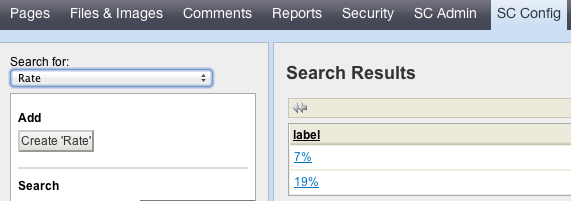
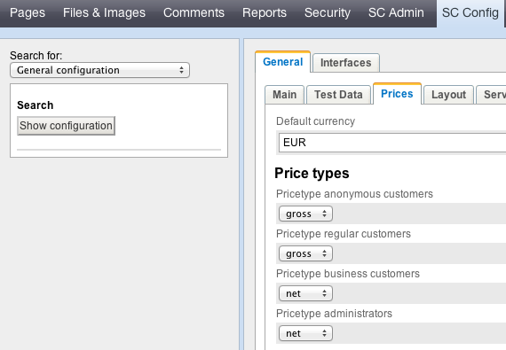

# Tax Handling

I always thought that our german tax laws would be complicated till I encountered with the US VAT system. We started off with SilverCart by implementing two different tax rates: 19% and 7%. They are set on every fresh SilverCart installation but can be edited easily (SilverCart Config→Rates):

Simply add a rate or edit the existing ones. Each rate has a label for display and a rate in % that is used for calculation.

SilverCart works out of the box with fix tax rates. However we made it quiet easy for developers to implement a dynamic tax systems where the tax depends on the customers shipping ZIP like in the USA.
## b2b or b2c, that is the question!
- - -

If You sell Your products to consumers (end customers) You do have a business-to-customer shop (b2c). If You sell Your products to other businesses You do have a business-to-business shop (b2b). In Germany b2b shops show their prices net, which means without the VAT. Businesses do not pay VAT or at least can subtract the VAT they took from VAT they payed. Anyways You want prices to be pretty like 9.99$ or 4.59$. That's why You can maintain a net price to a product. The VAT will then be added at the checkout and the prices will be ugly like 10.54$ or 4.87$.

A consumer needs gross prices shown. To provide pretty gross prices a product has a field “price gross”. This price is shown to consumers. On checkout the VAT will be subtracted and then added again on the price total.

SilverCart knows four different customer classes: Anonymous customers, regular customers, administrators and business customers. If someone registers on a fresh SilverCart installation he will end up as a regular customer. If he does not register at all he will be an anonymous customer. A registration for business customers is not implemented yet but this is done quiet easily by a developer. The shop owner's account is an administrator. More administrators can be created via backoffice.

You can configure weather a customer group gets prices shown gross or net. Visit the SilverCart Configuration→General configuration in the backoffice:

With four different dropdown fields the price type (net or gross) can be set for each customer group separately.
