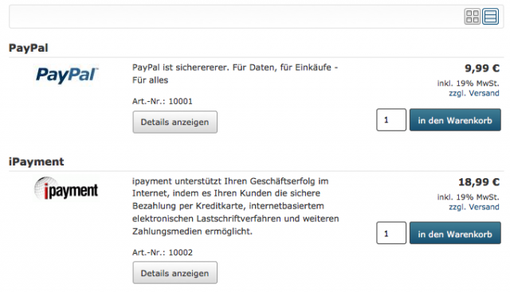
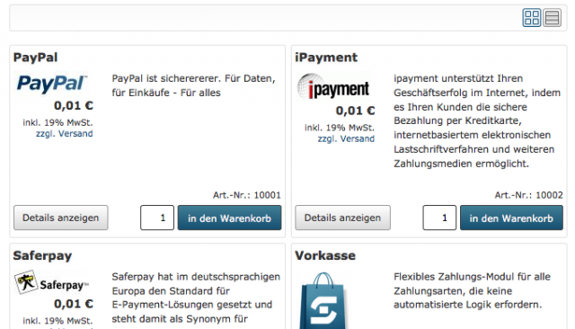
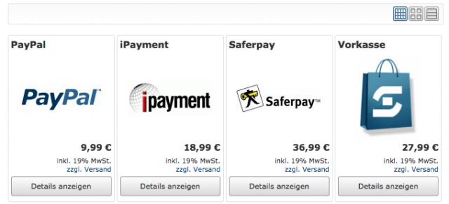

# Groupviews

## What is a GroupView?
- - -

SilverCart uses GroupViews to provide different display types of product groups and their products.

By default there are two different GroupViews available. They can be separately set for product groups and their products.

 

List view (SilvercartGroupViewList)
 

Tile view (SilvercartGroupViewTile)

## How to set a default GroupView?
- - -

The default GroupView is set when a customer visits the site the first time. It is configured in SilverCart's _config.php and can be overwritten in any other _config.php.

SilverCart's default settings for both, product groups and products, is the list view (SilvercartGroupViewList).

To change the default, open your projects _config.php (e.g. /mysite/_config.php) and set the defaults by calling the static accessors of SilvercartGroupViewHandler:

	:::php
	// default GroupView for product groups
	SilvercartGroupViewHandler::setDefaultGroupHolderView('SilvercartGroupViewTile');
	// default GroupView for products
	SilvercartGroupViewHandler::setDefaultGroupView('SilvercartGroupViewTile');

The default GroupView can be set to any other self implemented GroupView.

## How to disable a GroupView?
- - -

By default a customer can choose between list and tile view. Because this behaviour of SilverCart is not desired for all cases, a GroupView can be easily disabled.

The only things that have to be done is to open the projects _config.php (e.g. /mysite/_config.php) and calling the method:

	:::php
	// remove tile view for products
	SilvercartGroupViewHandler::removeGroupView('SilvercartGroupViewTile');
	// remove list view for product groups
	SilvercartGroupViewHandler::removeGroupHolderView('SilvercartGroupViewList');

By now, products are always displayed as a list and product groups are always displayed tiled. The customer cannot choose anymore.

## How to implement your own GroupView?
- - -

There are many ways to display products of a product group. In this case, let me show you how you can set up a group view with four tiles in a row.

This short tutorial shows how to create a small module that provides this four tiled GroupView.

### What do I need?

To implement an own GroupView, you need an extension of SilvercartGroupViewBase, a template and CSS for the products and product groups, and an image to use as indicator to choose the GroupView type.

Let's start by creating the modules directory silvercart_groupview_fourtile and an empty _config.php.

### Implementing the GroupView object

The first step to add the custom GroupView is to extend SilvercartGroupViewBase with SilvercartGroupViewFourtile. Create the file SilvercartGroupViewFourtile.php into the modules code folder like this:

	+ assets
	+ cms
	+ customhtmlform
	+ dataobject_manager
	+ googlesitemaps
	+ mysite
	+ requirements_engine
	+ sapphire
	+ silvercart
	- silvercart_groupview_fourtile
		- code
			- groupview
				SilvercartGroupViewFourtile.php
		_config.php
	+ silvercart_payment_paypal
	+ silvercart_payment_prepayment
	+ themes
	+ uploadify

Now, you need to add the method preferences() to your new class. The preferences() method delivers a few information about the GroupView as an array. A GroupView needs a 'code' to get identified, an 'i18n_key' and an 'i18n_default' to provide button labels.

The class SilvercartGroupViewFourtile should look like this:

###### SilvercartGroupViewFourtile.php

	:::php
	<?php
	 /**
	 * Provides a tiled group view with 4 objects in one row for products and
	 * productgroups.
	 *
	 * @package Silvercart
	 * @subpackage Groupview
	 * @author Sebastian Diel <sdiel@pixeltricks.de>
	 * @copyright 2013 pixeltricks GmbH
	 * @since 10.01.2012
	 *
	 * @see SilvercartGroupViewBase (base class)
	 * @see ProductGroupHolderFourtile.ss (template file)
	 * @see ProductGroupHolderFourtile.ss (template file)
	 */
	class SilvercartGroupViewFourtile extends SilvercartGroupViewBase {
	
		/**
		 * main preferences of the group view
		 *
		 * @return array
		 *
		 * @author Sebastian Diel <sdiel@pixeltricks.de>
		 * @since 10.01.2012
		 */
		protected function preferences() {
			Requirements::themedCSS('SilvercartGroupViewFourtile');
			$preferences = parent::preferences();
			$preferences['code']            = 'fourtile';
			$preferences['i18n_key']        = 'SilvercartGroupView.FOURTILE';
			$preferences['i18n_default']    = 'Four tiles';
			return $preferences;
		}
	}

As a little foreshadowing towards the template and CSS files, the Requirements call is already added to the SilvercartGroupViewFourtile::preferences() method.
### Adding the i18n support

To support multilingual button labels (in this case german and american english) the i18n index defined in SilvercartGroupViewFourtile::preferences() has to be added to the relevant i18n files.

	+ assets
	+ cms
	+ customhtmlform
	+ dataobject_manager
	+ googlesitemaps
	+ mysite
	+ requirements_engine
	+ sapphire
	+ silvercart
	- silvercart_groupview_fourtile
		- code
			- groupview
				SilvercartGroupViewFourtile.php
		- lang
			de_DE.php
			en_US.php
		_config.php
	+ silvercart_payment_paypal
	+ silvercart_payment_prepayment
	+ themes
	+ uploadify

Entry for german file de_DE.php:

	:::php
	$lang['de_DE']['SilvercartGroupView']['FOURTILE'] = 'Vier Kacheln';

Entry for english file en_US.php:

	:::php
	$lang['en_US']['SilvercartGroupView']['FOURTILE'] = 'Four tiles';

### Adding the Templates

Now it's time to add the templates, the CSS file and two icons for the new GroupView. Like mentioned in the Implementing the GroupView object part, the CSS file has to be included by calling Requirements::themedCSS('SilvercartGroupViewFourtile') in the SilvercartGroupViewFourtile::preferences() method.

The content of the template files is a little to long to display here, but you can Download all the relevant files of this HowTo as a kind of GroupView module at the end of the HowTo. Instead of just displaying the templates code, let me explain how I created them.

The first step I did was to copy the two templates of the default tile GroupView out of the SilverCart core template directory into the new GroupView template directory. The source templates are SilvercartProductGroupPageTile.ss to display the products and SilvercartProductGroupHolderTile.ss to display the product groups. Then I renamed them to SilvercartProductGroupPageFourtile.ss and SilvercartProductGroupHolderFourtile.ss. Now I changed the control logic to match the requirements to display four products a row instead of only two.

It's important to know that a GroupView is rendered in a custom context, handled by the SilvercartGroupViewDecorator. The products or product groups and the relevant meta info can be accessed by the ComponentSet Elements (used in the main control of the GroupView templates).

The CSS file is very small and provides some basic rules to unify the tiles size.

The icons are needed to display the buttons to switch to the GroupView or indicate the current GroupView. They have to be set in the preferences of the GroupView, so let's have another look into the SilvercartGroupViewFourtile::preferences() method to add the image for the active and inactive GroupView state.

###### SilvercartGroupViewFourtile.php

	:::php
	<?php
	/**
	 * Provides a tiled group view with 4 objects in one row for products and
	 * productgroups.
	 *
	 * @package Silvercart
	 * @subpackage Groupview
	 * @author Sebastian Diel <sdiel@pixeltricks.de>
	 * @copyright 2013 pixeltricks GmbH
	 * @since 10.01.2012
	 *
	 * @see SilvercartGroupViewBase (base class)
	 * @see ProductGroupHolderFourtile.ss (template file)
	 * @see ProductGroupHolderFourtile.ss (template file)
	 */
	class SilvercartGroupViewFourtile extends SilvercartGroupViewBase {
	
		/**
		 * main preferences of the group view
		 *
		 * @return array
		 *
		 * @author Sebastian Diel <sdiel@pixeltricks.de>
		 * @since 10.01.2012
		 */
		protected function preferences() {
			Requirements::themedCSS('SilvercartGroupViewFourtile');
			$preferences = parent::preferences();
			$preferences['code']            = 'fourtile';
			$preferences['i18n_key']        = 'SilvercartGroupView.FOURTILE';
			$preferences['i18n_default']    = 'Four tiles';
			$preferences['image_active']    = 'silvercart_groupview_fourtile/images/icons/20x20_group_view_fourtile_active.png';
			$preferences['image_inactive']  = 'silvercart_groupview_fourtile/images/icons/20x20_group_view_fourtile_inactive.png';
			return $preferences;
		}
	}

After doing all this steps, your directory should look like that:

	+ assets
	+ cms
	+ customhtmlform
	+ dataobject_manager
	+ googlesitemaps
	+ mysite
	+ requirements_engine
	+ sapphire
	+ silvercart
	- silvercart_groupview_fourtile
		- code
			- groupview
				SilvercartGroupViewFourtile.php
		- css
			SilvercartGroupViewFourtile.css
		- images
			- icons
				20x20_group_view_fourtile_active.png
				20x20_group_view_fourtile_inactive.png
		- lang
			de_DE.php
			en_US.php
		- templates
			- Includes
				SilvercartProductGroupHolderFourTile.ss
				SilvercartProductGroupPageFourTile.ss
		_config.php
	+ silvercart_payment_paypal
	+ silvercart_payment_prepayment
	+ themes
	+ uploadify

### How to enable the GroupView?

Enabling a GroupView is as hard as disabling a GroupView:

Call the static method SilvercartGroupViewHandler::addGroupView() in the _config.php.

	:::php
	// adds the four tiled GroupView to the GroupView handler (products)
	SilvercartGroupViewHandler::addGroupView('SilvercartGroupViewFourtile');
	// adds the four tiled GroupView to the GroupView handler (product groups)
	SilvercartGroupViewHandler::addGroupHolderView('SilvercartGroupViewFourtile');

### The result

The result is… Well, the result is a four tiled GroupView…

### Download the files

Finally you can download the little module as a tar.gz right here:

silvercart_groupview_fourtile.tar.gz
### Backward compatibility

**Stop:** To be backward compatible with early SilverCart 1.2 versions (downloaded before January 13th 2012) you have to add an additional class to the GroupView package.

	:::php
	/**
	 * Dummy form to be backward compatible to the basic SilverCart 1.2 version
	 *
	 * @package Silvercart
	 * @subpackage Groupview
	 * @author Sebastian Diel <sdiel@pixeltricks.de>
	 * @copyright 2013 pixeltricks GmbH
	 * @since 10.01.2012
	 * @license see license file in modules root directory
	 */
	class SilvercartProductAddCartFormFourtile extends SilvercartProductAddCartForm {
	}
