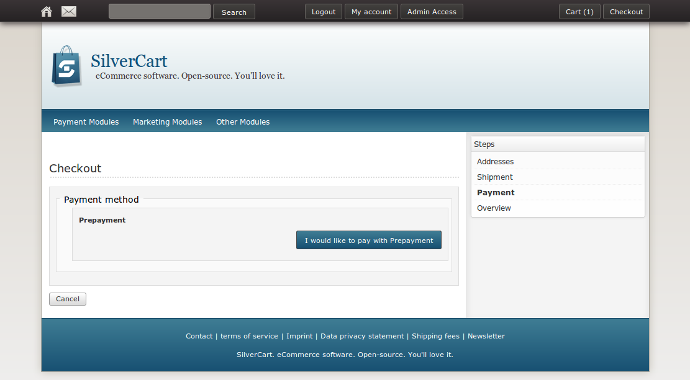
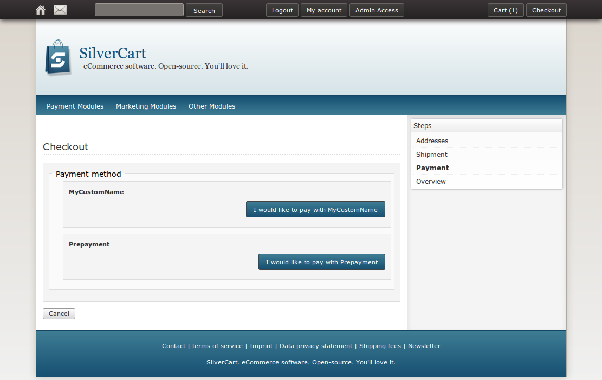

# Payment module basics

**Stop:** This page is still under construction with several details not yet written.

It's published because some developers need parts of the information right now - use it on your own risk. 

## What is a SilverCart payment module
- - -

A payment module is integrated into the checkout process and gives your customers a way to pay for their shopping cart. It consists of a payment class, a sequence of steps and language files.
### Directory structure of a payment module

Regarding it's directory structure, a SilverCart payment module is organized like an ordinary Silverstripe module.

You create a folder structure on the root level of your Silverstripe installation that looks like the following:

	+ customhtmlform
	...
	+ silvercart
	...
	- silvercart-payment-mycustomname
      - _config
	  - code
        - Forms
          - CheckoutFormStep1.php
          - CheckoutFormStep2.php
          - ...
        - Model
		  - PaymentMyCustomName.php
		  - PaymentMyCustomNameTranslation.php
          - ...
	  - lang
		  en.yml
		  ...
	  - templates
		- Forms
		  - CheckoutFormStep1.ss
		  - CheckoutFormStep2.ss
	  _config.php

### Bundling code in the payment class

All of your business logic should be located in the payment class (“PaymentMyCustomName” in our above example).
### Payment sequence steps

The payment module sequence steps can display informations to your customer, ask data from them or execute processing logic like getting tokens from payment providers or jumping to a payment provider's checkout.

During the payment module sequence the shopping cart gets transferred into an order.
## Points of action
- - -

Have a look at this sequence which describes the checkout process:

Actually our payment module has two key points of action:

1. The entry for the “Choose payment method” page
2. The payment method sequence after the customer has chosen our payment module for paying

### Make your module appear one the "Choose payment method" page

Our goal is to add an existing custom payment module to the payment options on the “Choose your payment” page:

### 1) Check if the module is installed properly

In the screenshot below you can see the payment module “MyCustomName” in the payment method administration area. That means the module has been installed properly but with the current setup it won't yet be available in the checkout process.

### 2) Activate the module

Click on the module's name in the table to go to the module configuration page. There you'll see a checkbox “Activated” - click on it and save the settings.

### 3) Attribute the module to a country

Now we have to attribute our payment module to a country. To do that we have to go to the country configuration section.

In the following example we attribute the module to the “United States”. Clicking on the name of the country in the table leads us to the country's edit page where we can take action.

Under the tab “Payment method” you can attribute payment methods to the country by activating or deactivating the checkbox left to the payment method's name. Don't forget to save the settings.

After activating the module “MyCustomName” everything is set so that our module will appear in the checkout process.
### 4) See your module in the checkout process

Et voilà - our custom module is displayed as a payment option:

### Define your custom checkout sequence

The payment process is a sequence of steps. Those steps can differ for every payment module and can be defined without limitations as long as you respect some conventions.

Payment steps are actually CustomHtmlForm steps, so every step is a class/template file tandem.
#### Conventions for sequence files

1. Place your sequence of steps in the directory “silvercart_payment_mycustomname/checkout/”
2. Use the naming scheme “Payment{MyCustomName[FormStep{n[.php” for the class files.
     * If you have two steps for your payment module “MyCustomName” your class files should look like this:
       * CheckoutFormStep1.php
       * CheckoutFormStep2.php
3. Every step needs a template for the php class. The templates should be located inside the folder “silvercart_payment_mycustomname/templates/checkout/”.
4. The templates need to follow the naming scheme for the php classes, except that the file extension is ”.ss” instead of ”.php”.
   * According to our example for the php classes your template files should be named like this:
     * CheckoutFormStep1.ss
     * CheckoutFormStep2.ss

## Skeleton for a custom payment class
- - -

###### PaymentMyCustomName.php

	:::php
	<?php
    namespace MyNameSpace\MyCustomName\Model;
    use SilverCart\Model\Payment\PaymentMethod;
    use SilverStripe\Forms\FieldList;
	/**
	 * Class description.
	 *
	 * @package {package}
	 * @subpackage {subpackage}
	 * @author {author}
	 * @since {since}
	 */
	class PaymentMyCustomName extends PaymentMethod {
	
		/**
		 * contains module name for display in the admin backend
		 *
		 * @var string
		 *
		 * @author {author}
		 * @since {since}
		 */
		protected $moduleName = 'MyCustomName';
		
		/**
		 * A list of possible payment channels.
		 *
		 * @var array
		 *
		 * @author {author}
		 * @since {since}
		 */
		private static $possible_payment_channels = [];
		
		/**
		 * returns CMS fields
		 *
		 * @param mixed $params optional
		 *
		 * @return FieldList
		 *
		 * @author {author}
		 * @since {since}
		 */
		public function getCMSFields($params = null) {
			$fields         = parent::getCMSFieldsForModules($params);
			$fieldLabels    = self::$field_labels;
			
			return $fields;
		}
		
		// ------------------------------------------------------------------------
		// processing methods
		// ------------------------------------------------------------------------
		
		/**
		 * hook to be called before order creation
		 *
		 * You can use this method to create tokens and/or jump to your payment
		 * provider.
		 *
		 * @return void
		 *
		 * @author {author}
		 * @since {since}
		 */
		public function processPaymentBeforeOrder() {
		}
		
		/**
		 * hook to be called after jumpback from payment provider; called before
		 * order creation
		 *
		 * @return void
		 *
		 * @author {author}
		 * @since {since}
		 */
		public function processReturnJumpFromPaymentProvider() {
		}
		
		/**
		 * hook to be called after order creation
		 *
		 * @param Order $orderObj object to be processed
		 *
		 * @return void
		 *
		 * @author {author}
		 * @since {since}
		 */
		public function processPaymentAfterOrder($orderObj = array()) {
		}
		
		// ------------------------------------------------------------------------
		// payment module specific methods
		// ------------------------------------------------------------------------
		
		// ...
	}

## Helper methods from the PaymentMethod class
- - -
Since your payment class extends the PaymentMethod class you have access to a bunch of useful methods:

	:::php
	$this->getReturnLink();
	$this->getCancelLink();
	$this->getInvoiceAddress();
	$this->getShippingAddress();
	$this->getCustomerDetails();
	$this->getShoppingCart();
	$this->getOrder();

Let's take a closer look at those methods:
### getOrder()

Keep in mind that this method returns the desired information only after the order has been saved in the webshop. So you should only call it from the method “processPaymentAfterOrder” or later in your payment class.
### getShoppingCart()
### getInvoiceAddress()
### getShippingAddress()
### getCustomerDetails()
### getReturnLink()
### getCancelLink()
## Helper classes for payment sequence steps
- - -
SilverCart offers CustomHtmlForms that provide basic functionality and can be extended by every payment module's steps:

* **CheckoutFormStepPaymentInit**
  * This is the common base for all steps that don't need the following two special cases. It checks if the user may use the checkout process and provides handy methods e.g. for getting the current payment method object.
* **CheckoutFormStepProcessOrder**
  * This is the step that transfers the shoppingcart to an order.
* **CheckoutFormStepDefaultOrderConfirmation**
  * Usually the last step in the checkout process. It displays a status page that informs the customer about the current status.
     
Let's have a look at how some existing payment modules use that structure:
### Example: Prepayment

* **\SilverCart\Prepayment\Forms\CheckoutFormStep1:** Extends “CheckoutFormStepPaymentInit”
* **\SilverCart\Prepayment\Forms\CheckoutFormStep2:** Extends “CheckoutFormStepProcessOrder”
  * The shoppingcart gets transferred to an order
* **\SilverCart\Prepayment\Forms\CheckoutFormStep3:** Extends “CheckoutFormStepDefaultOrderConfirmation”

### Example: Paypal

* **\SilverCart\PayPal\Forms\CheckoutFormStep1:** Extends “CheckoutFormStepPaymentInit”
  * Redirects the user to the paypal checkout website
* **\SilverCart\PayPal\Forms\CheckoutFormStep2:** Extends “CheckoutFormStepPaymentInit”
  * Handles the jump back from paypal to the shop website
* **\SilverCart\PayPal\Forms\CheckoutFormStep3:** Extends “CheckoutFormStepProcessOrder”
  * The shoppingcart gets transferred to an order
* **\SilverCart\PayPal\Forms\CheckoutFormStep4:** Extends “CheckoutFormStepPaymentInit”
  * Approves the order and payment with paypal
* **\SilverCart\PayPal\Forms\CheckoutFormStep5:** Extends “CheckoutFormStepDefaultOrderConfirmation”
  * Displays the standard order confirmation page to the customer

##Jumping from the webshop to the payment provider
- - -
### Implement the method "processPaymentBeforeOrder" in your payment class

	:::php
	public function processPaymentBeforeOrder() {
		$this->getController()->addCompletedStep($this->getController()->getCurrentStep());
		$this->getController()->addCompletedStep($this->getController()->getNextStep());
		$this->getController()->setCurrentStep($this->getController()->getNextStep());
		
		if ($this->mode == 'Live') {
			Director::redirect({LIVE_URL_TO_YOUR_PAYMENT_PROVIDER_GATEWAY});
		} else {
			Director::redirect({DEVELOPMENT_URL_TO_YOUR_PAYMENT_PROVIDER_GATEWAY});
		}
	}

What are we doing here?

	:::php
	$this->getController()->addCompletedStep($this->getController()->getCurrentStep());

Since we are in the checkout process we want to set the current step as completed. This is important because of the return link that we get from “$this→getReturnLink();”; this link directs to the exact same URL in the checkout process where we are. If the current step is not completed it would be displayed again.

	:::php
	$this->getController()->addCompletedStep($this->getController()->getNextStep());

We set the following step as completed, too, because it contains a processor method only.

	:::php
	$this->getController()->setCurrentStep($this->getController()->getNextStep());

Finally we set the current step to the following one, so that the correct step gets executed after the return jump from the payment provider.

	:::php
	if ($this->mode == 'Live') {
		Director::redirect({LIVE_URL_TO_YOUR_PAYMENT_PROVIDER_GATEWAY});
	} else {
		Director::redirect({DEVELOPMENT_URL_TO_YOUR_PAYMENT_PROVIDER_GATEWAY});
	}

This is the code that executes the jump to the payment provider. In this case we distinguish between live and dev mode. If your payment provider differentiates live and dev mode by another way you could just do a “Director::redirect()” here without the if block.
### Call "processPaymentBeforeOrder" from your sequence step

	:::php
	public function process() {
		if (parent::process()) {
			$this->paymentMethodObj->processPaymentBeforeOrder();
		}
	}

## Channels for payment modules
- - -

### What is a channel?
### Defining channels