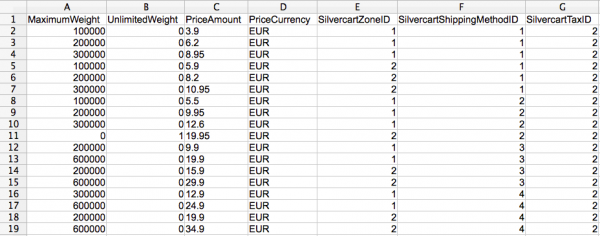
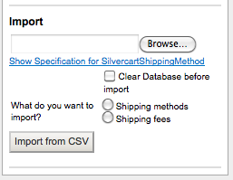
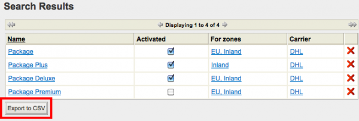
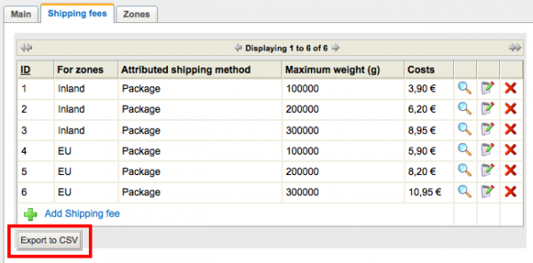

# Import & Export

## CSV import
- - -

There are two steps that have to be done to import shipping methods and their fees.

1. Importing a CSV file for the shipping methods
2. Importing a CSV file for their fees

### Available shipping method columns and their meaning

The available columns are:

* ID (optional)
 * Matches the ID of an existing shipping method. Only needed to update existing shipping methods. 
 * Can be empty for new shipping methods
* Title
 * Title to display
* isActive
 * Determines whether the shipping method is active for checkout or not
* CarrierID
 * The ID of the related carrier
* AttributedZoneIDs
 * One or more IDs of related zones
 * If there are more than one related zones they have to be set comma separated

Example file to import four new shipping methods:

### Available shipping fee columns and their meaning

The available columns are:

* ID (optional)
 * Matches the ID of an existing shipping fee. Only needed to update existing shipping methods.
* MaximumWeight
 * The maximum weight (in gram) of products in cart to use the fee for
* UnlimitedWeight
 * Determines whether the shipping fee is used for unlimited weight of products in cart
* PriceAmount
 * Price amount of the fee (e.g. 3.9)
* PriceCurrency
 * Price currency of the fee (e.g. EUR)
* ZoneID
 * ID of the related zone
* ShippingMethodID
 * ID of the related shipping method
* TaxID
 * ID of the tax to use for the fee

Example file to import new shipping fees, related to the shipping methods:

### Structure of the CSV

The columns of the file have to be set in opening and closing quotes (”). The character to separate the columns is a semi-colon (;).

Here is an example content of a CSV file:
	:::php
	"ID";"Title";"isActive";"CarrierID";"AttributedZoneIDs"
	"1";"Package";"1";"1";"2;"2,1"
	"2";"Package Plus";"1";"1";"1"
	"3";"Package Deluxe";"1";"1";"2, 1"
	"4";"Package Premium";"0";"1";"2, 1"

### Import the files

To import the files, the custom import form of the SC Config → Shipping method section has to be used.

 There is a special input mask to choose whether to import shipping methods or shipping fees (“**What do you want to import?**”). So, before the “Import from CSV” button is pressed, one of the radio buttons has to be checked.

First, import the shipping methods. You can predefine the IDs of the shipping methods to predefine the shipping method ↔ shipping fee matching, but be careful to use new unique IDs for new shipping methods. If an already existing ID is used, the existing shipping method will be overwritten by the new one.

After the shipping methods are imported, import the fees. Just add your file to the file input field, choose the other radio button “Shipping fees” as value for the “What do you want to import?” field and press the “Import from CSV” button again.
## CSV export
- - -

To export the existing shipping methods as a CSV file, use the button “Export to CSV” at the overview table of the shipping methods in the SC Config → Shipping method section.

Shipping fees can be exported inside of a shipping method. Choose the shipping method you want to export the fees for and click the “Export to CSV” button inside of the “Shipping fees” tab.

