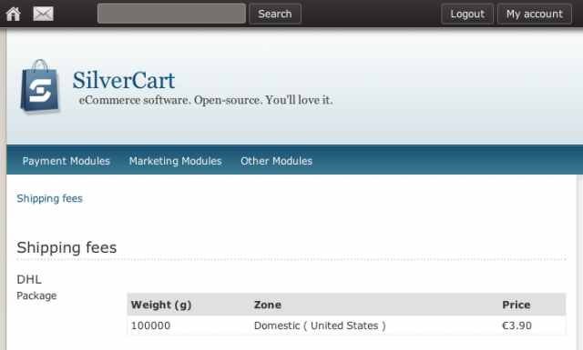
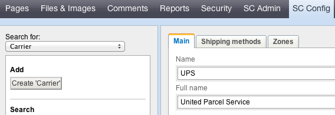
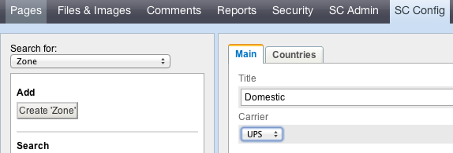
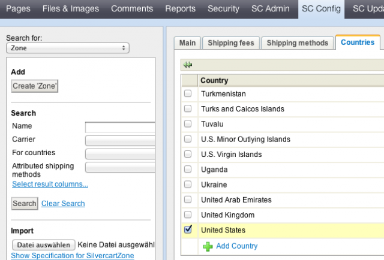
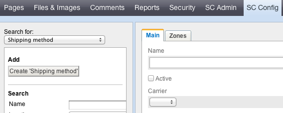
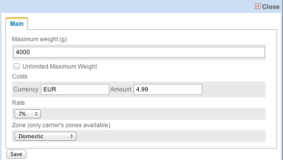
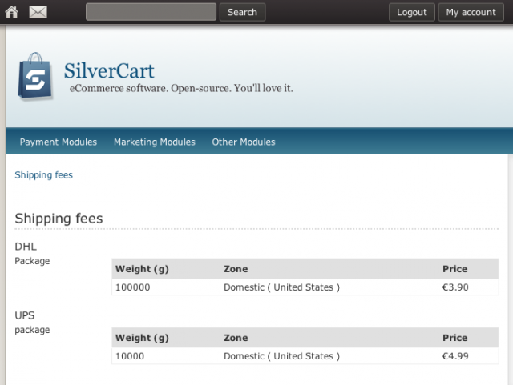

# Shipping Fee Management

* [Import & Export](1-Import-and-Export#import-and-export)

We implemented the calculation of shipping fees by regarding how carriers define them. There may be differences from carrier to carrier but they are not vast.

A shipping fee always depends on a packages weight. As a product has a weight SilverCart calculates the total weight during the checkout. But a shipping also depends on the destination and there may be different shipping methods as well: express, ensured shipping, cash on delivery, and so on. That's why SilverCart needs four different things to calculate the shipping fee: A carrier, zones (existing of countries), shipping methods and the shipping fees. Carriers do not have shipping fees per country, this would be too confusing. They put countries together in zones and make shipping fees dependent on zones.
## The State On a fresh SilverCart Installation
- - -

A basic installation of SilverCart already has a shipping method set: DHL-package. There is a carrier “DHL” with two associated zones: Domestic (Germany) an EU (no countries associated). There is one shipping method for DHL called “package” with one shipping fee (1000g maximum weight, 3.90€ costs). This is just for your comfort, you may delete this if it is not needed. You can see this shipping fee by visiting the site [mysite.com]/home/metanavigation/shipping-fees/ in the storefront.

## Adding Your Own Shipping Fees
- - -

In an example I will show you how to create a new shipping fee from a new carrier called UPS.

Log yourself in to the backoffice and go to "Handling"→"Carriers":

This shows the carrier DHL, the two attributed zones domestic and EU and the attributed sipping method package. Create a new carrier by choosing the “Create Carrier” button on the left side. As the carriers mostly have short names you can add a full name as well. The full name is not used anywhere yet.

After you have added “UPS” you can see two tabs: Zones and shipping methods.

Now you have to create a zone for the carrier UPS. Go to SilverCart Configuration→Zone and use the button “Create Zone”:

I called the new zone “Domestic” and choose our new carrier “UPS” from the dropdown. Save you newly created zone before proceeding.

Now countries must be attributed to that zone. I go to the tab “Countries” and set the checkbox to USA. Press the button “save” on the low right and your new zone is fully configured.

Now we need a shipping method for our new carrier “UPS”. Go to SilverCart Configuration→Shipping Method and press the button “Create ShippingMethod”. You will see the following:

Add a name, activate the new shipping method and assign the carrier “UPS”. Press the button “add” on the lower right. After that go to the tab “Zones” and assign the Zone “Domestic” by “UPS” we created in the step before. Press the “save” button on the lower right and the shipping method is fully configured.

The last step will be creating a shipping fee. Shipping fees depend on the weight and a shipping method may have many shipping fees.

Visit the tab “shipping fees” of the shipping method we just created:

Press the button “Add shipping fee”. You will see this popup which I already filled in:

If you are done press the save button.

Now the new shipping method and its shipping fee is up and running. Customers may use it on checkout if the weight fits the shipping fee. It is also shown on the shipping fees page:

