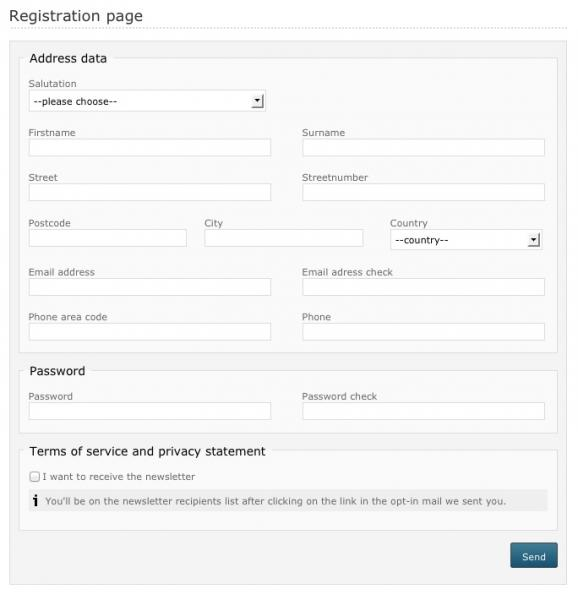
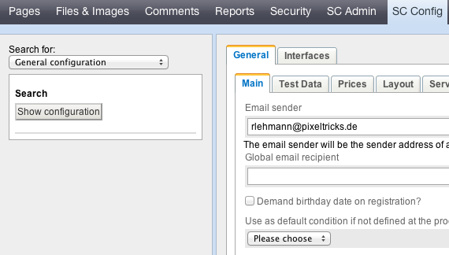

# Customer Management

## The Registration Process
- - -

A new customer can register to the store on a one page form. The dropdown for countries shows only countries activated in the store admin. The email address needs a double input, like the password, for security reasons. As long as the terms of service and the revocation instructions are not accepted the form can not be submitted. Terms of service and revocation instructions have links to the corresponding pages. The customer may toggle the newsletter via a checkbox.

Note: At the "Settings" section you may configure wether the birth date is asked during the registration or not:

After a successful registration the customer will be prompted that he is logged in already.
## Creating an Administrator
- - -

Visit the area “Security”. Choose “Administrators” from the security groups. On the right side you can see a table with already registered admins. Register a new administrators by filling out the input fields at the end of the table. The email address and the password are mendatory. Leave out the customer number.

The default admin is a developer account. It was created as the software was installed. You may deleted it but it will always appear again. The one who has access to SilverCart's code or the database always has access to the backend.
## Anonymous Customers
- - -

If a customer adds a product to the cart without being logged in an anonymous customer is created. The customer's browser gets a cookie and can access this cart for the next days. After some days the cookie expires and the unregistered customer looses his cart. If an anonymous customer registers the cart will be moved for the customers convenience.
## Customer Categories
- - -

The store uses categories to determine if a customer is business, regular or anonymous. There are no further implementations yet.
