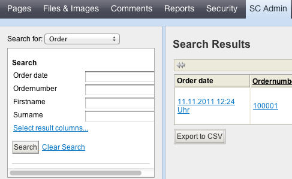
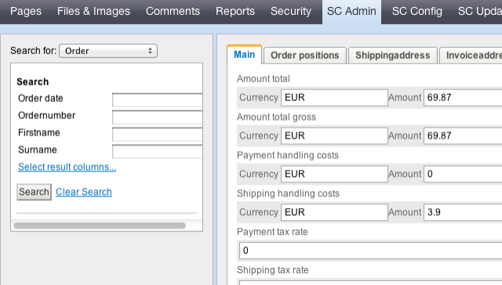
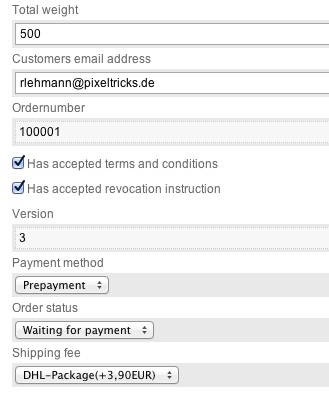

# Order Management

If you visit the SilverCart Administration the orders are loaded by default because they are supposed to be the most interesting part for a store owner:

Use the form on the left to filter the results. The most recent order is always on top. All information of an order is saved seperatly. For example, if a product description changes after the customer has bought a product the product description in the order does not change.

Let's have a look at an order's details in two steps (otherwise the screenshot will be too long ;):

You can see the amounts and the currencies the customer payed his order in. Beneath there amounts vou can see the tax information. If the customer left a note, it will be displayed here too. The total weight was calculated from the position weight sum and has the unit gram(or whatever unit's figure you entered when editing the products.

There are two additional tabs for the shipping address and the invoice address. Their fields are read only to prevent anyone from changing them. There is one tab for the order's positions too which gives all info about the products. The details view of an order position shows the current name of a product in case it differs from the name of the product when it was bought.

Now for the second part of the order details:

Two checkboxes show if the user has accepted the terms and conditions and the revocation instructions during the checkout process. In fact a customer can not check out without accepting them. This is just to be sure if a client calls and tries to convince you of something else.

The version figure shows how often an order has been edited. An untouched order shows the value “3”. If the order would have been changed one time the version number would be “4”. The versions are saved in the database and could be restored by a programmer.

The payment method is shown as a dropdown value. The shipping fee is shown with carrier and shipping method as a prefix.

The order status shows the default value of the payment method. This should be edited by the shop owner if neccesary.
